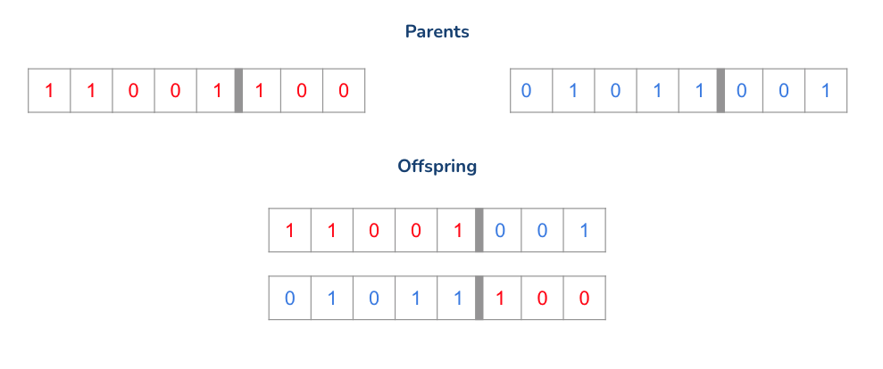
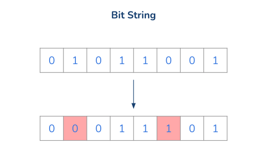
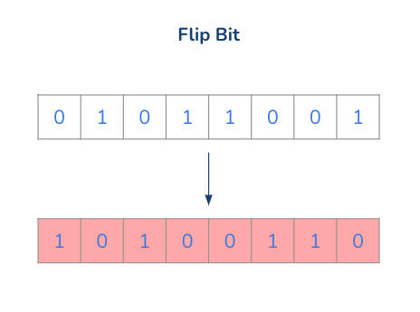
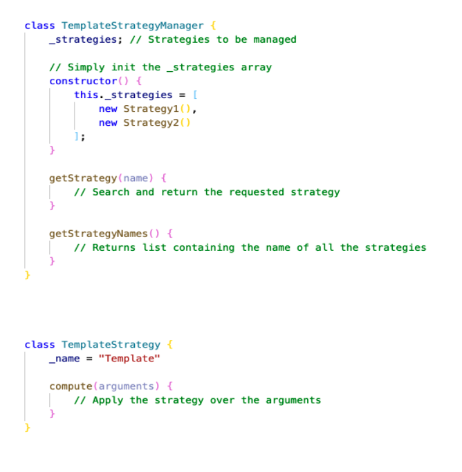
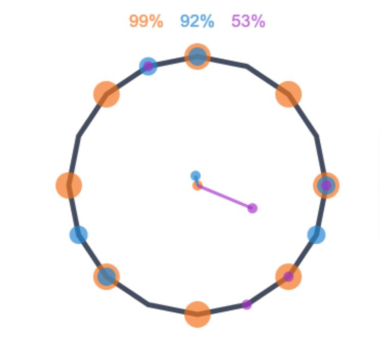
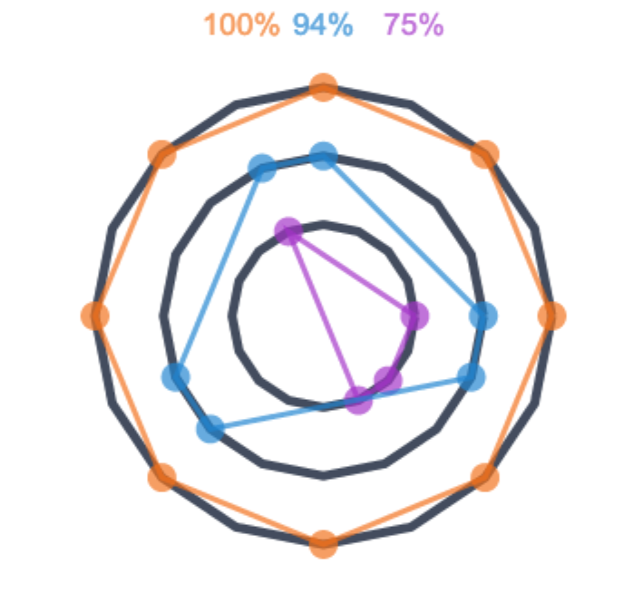
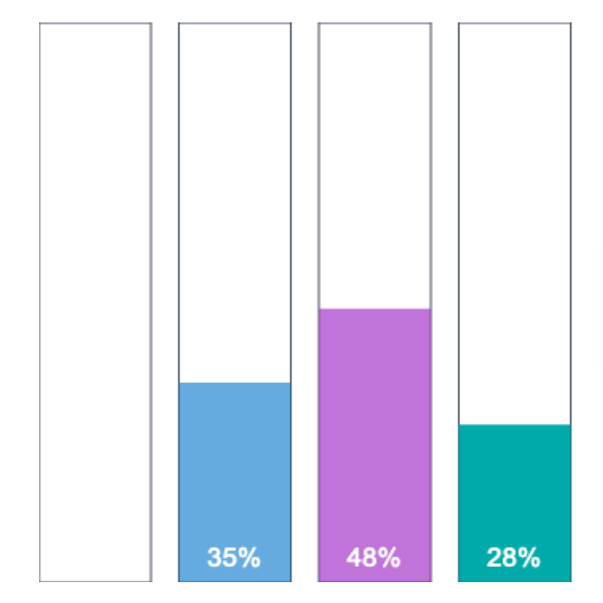

# Beat Generation
Rhythmic Pattern generation using Genetic Algorithms

## Description
Our project aims at finding a score to evaluate different rhythms according to some well known analytical features that exploit their euclidean representation.
The final goal is to use them as fitness functions on a Genetic Algorithm and see how it behave with them.
The final result is the generation of a pool of rhythms for which it is provided a graphic modelization of the features, allowing the user to understand them in a deeper and more intuitive way.

## How it works
The home page is where it is possible to set up the main characteristic of the Genetic Algorithm that we want to build and use.
It is divided in sections, and have sliders for numerical values and dropdown menus for selecting the desired option.
The sections are the following:

---

### Fitness
Section in which we can choose the scoring function and the number of initial elements
##### Starting Population

Number of patterns generated randomically that compose the first generation

##### Fitness Strategy

Fitness function to be used

Balance:
The balance of a rhythm is a quantification of the proximity of that rhythm's “centre of mass” to the centre of the unit circle

Evennes:
The evenness of a rhythm is a quantification of the lack of variance of its interonset intervals. If the rhythm's interonset intervals are all similar in duration, the rhythm will have high evenness

Entropy:
Entropy quantifies the unpredictability of a probability mass function.

Milne-Herff:
As stated by Milne and Herff is a combination of all the features above

---

### Selection
The selection phase is when the fittest individuals are selected as parents for breeding the next generation
##### Survival Rate

Percentage of individuals that will survive as parents

##### Selection Strategy

Function to be used to choose the surviving individuals

Fittest Survive: Is the simplest, just the fittest indivuals can survive

Roulette Wheel: Each individual has a probability to survive, which is proportional to its fitness score 

---

### Crossover
During this phase pairs of individuals are combined in order to create a new offspring characterized by the predominant features of the parents.

##### Crossover Probability

Probability of each element to be part of the Crossover phase.
Otherwise the parents will survive to the next generation instead of mating.

##### Crossover Strategy

The combination modality to generate new patterns

Single Point: A point on both parents' chromosomes is picked randomly, and designated a 'crossover point'. Bits to the right of that point are swapped between the two parent chromosomes. This results in two offspring, each carrying some genetic information from both parents.

Two Point: Two crossover points are picked randomly from the parent chromosomes. The bits in between the two points are swapped between the parent organisms.

---

### Mutation
Mutation occurs to maintain diversity within the population and prevent premature convergence.

##### Mutation Probability

Probability of each element to be subjected to a mutation.

##### Mutation Strategy

Type of mutation to be applied
Bit String: The mutation of bit strings ensue through bit flips at random positions.

Flip Bit: This mutation operator takes the chosen genome and inverts the bits, if the genome bit is 1, it is changed to 0 and vice versa.

---

## Drum Theme
Allows the user to customize the patterns choosing between different sets of drum samples.

---

## Overlay Window
After having set up all the parameters and pressed the *Start Process* button, an overlay window will appear in front of the main page.
This window will display on the left, the list of the generated patterns, each with an unique name, and on the right the different representations of the features that characterize it.
##### Player
Thanks to the player, the user has the possibility to play with each one of the final rhythms muting or unmuting the single sequences and adding the metronome.

## Brief Code Overview

*GeneticAlgorithm* class: is initialized by calling the constructor and all its "init" functions by passing to them the parameters retrieved from the model. After the initialization, it is possible to call the *start()* that will eventually return the final population generated by applying the chosen rules and parameters in the initialization.

*Pattern* class: class that contains all the useful informations (e.g. sequences, id, score) to be stored for each single individual of the population.

*Strategy Pattern*: We used the strategy design pattern to manage the different functions to be used by the GeneticAlgorithm class.
The Strategy and StrategyManager templates are the following

## Representations
**Overview**: Shows the euclidean representation of the rhythm

**Balance**: The balance of a rhythm is a quantification of the proximity of that rhythm's “centre of mass” to the
                centre of the unit circle

**Evenness**: The evenness of a rhythm is a quantification of the lack of variance of its interonset intervals.
If the rhythm's interonset intervals are all similar in duration, the rhythm will have high evenness

**Entropy**: Entropy quantifies the unpredictability of a probability mass function computed on the intervals between the onsets of the rhythmic sequence

## Video Demo  

